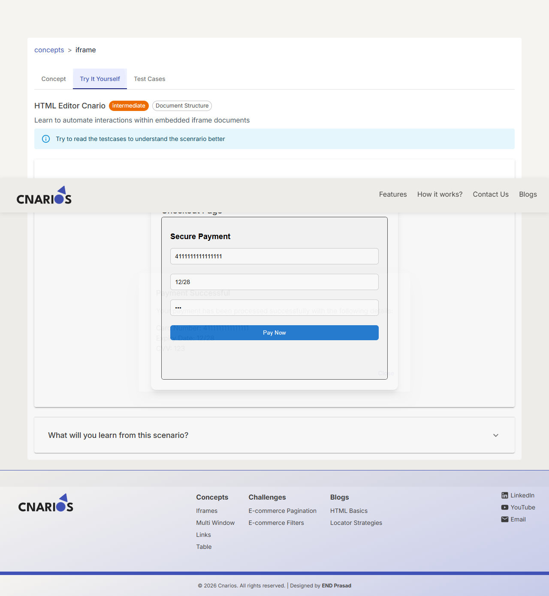
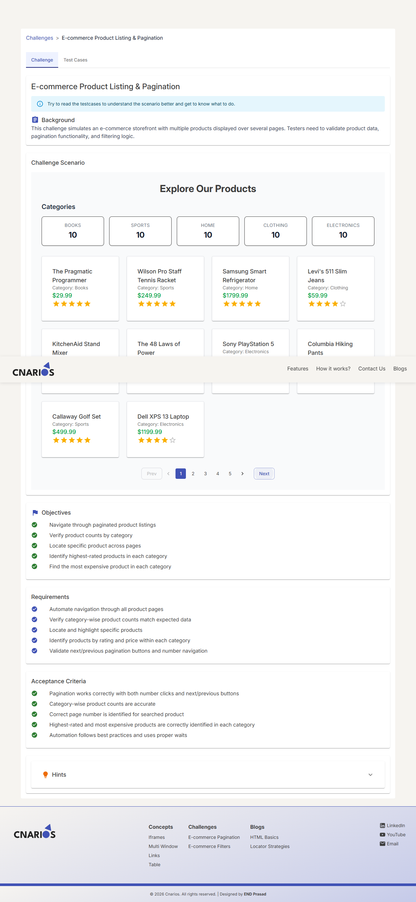
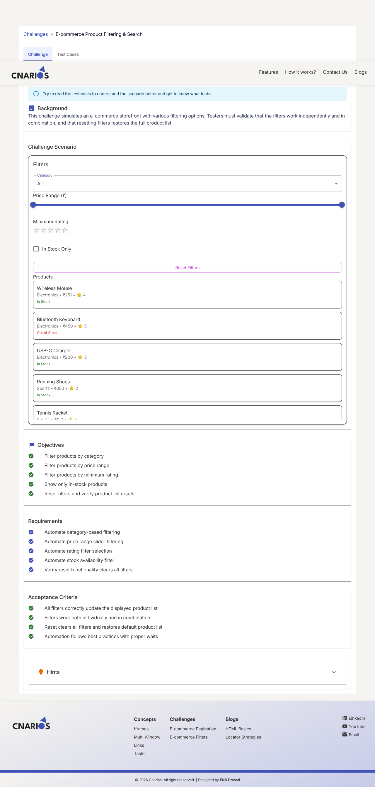
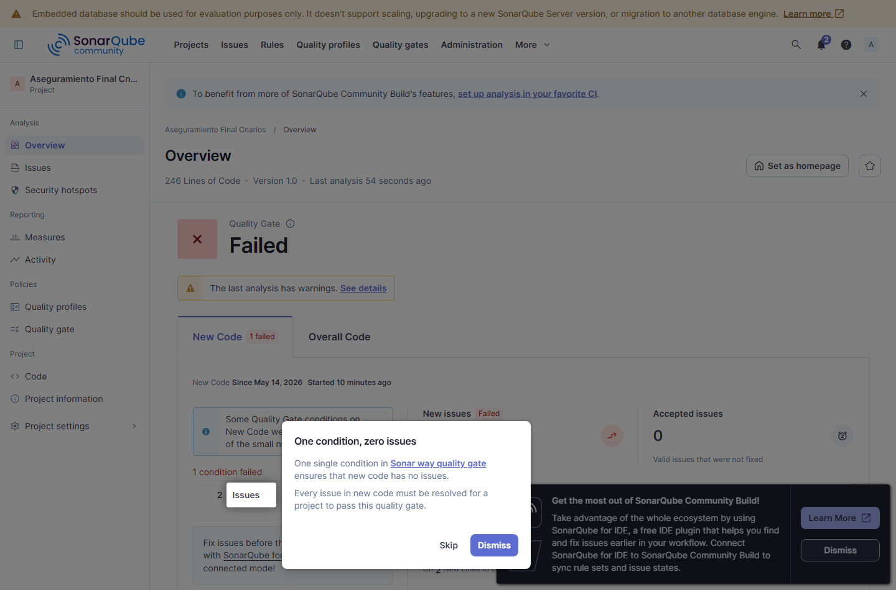

<div class="cover">

# Caso Practico Final - Pruebas sobre Cnarios

**Asignatura:** Aseguramiento de la Calidad - Ingenieria de Sistemas  
**Integrantes:** Ziuvar / Equipo QA  
**Fecha:** 24 de mayo de 2026  
**Sistema evaluado:** https://www.cnarios.com  

</div>

## 1. Introduccion

El presente informe constituye la entrega final del caso practico de la asignatura Aseguramiento de la Calidad. El objetivo general es aplicar de manera integrada los conocimientos adquiridos durante el curso para planificar, disenar, ejecutar y documentar pruebas sobre un sistema de software real.

Se selecciono Cnarios, una plataforma gratuita orientada a testers y automatizadores. El sitio ofrece conceptos de automatizacion, desafios inspirados en flujos reales y blogs de aprendizaje. La eleccion se justifica porque permite practicar con componentes frecuentes en aplicaciones web: iframes, multiples ventanas, enlaces, tablas, paginacion, filtros y contenido educativo.

El trabajo no se limita a una descripcion teorica. Se implemento un repositorio de pruebas con Playwright y TypeScript, scripts de revision pasiva de seguridad, prueba basica de carga con k6 en Docker, configuracion de OWASP ZAP, configuracion SonarQube y pipeline CI/CD.

## 2. Contexto del Proyecto

### 2.1 Descripcion general

Cnarios es un sitio web para practicar automatizacion de pruebas. El portal esta organizado en secciones de conceptos, desafios, preguntas de entrevista y blogs. Cada concepto incluye una explicacion y, en varios casos, una zona interactiva para ejecutar pruebas. Los desafios simulan flujos de comercio electronico, como paginacion y filtrado de productos.

### 2.2 Problema que resuelve

Muchos sitios de practica usan ejemplos artificiales que no se parecen a productos reales. Cnarios busca cerrar esa brecha mediante escenarios mas representativos, permitiendo que estudiantes y testers practiquen pruebas funcionales, exploratorias, automatizadas, de compatibilidad, rendimiento y seguridad basica sin desplegar un servidor propio.

### 2.3 Arquitectura y tecnologias

El codigo fuente de Cnarios no esta publicado, por lo cual el proyecto se evalua como caja negra. Por observacion del sitio, se comporta como una aplicacion web cliente-servidor tipo SPA.

```text
Usuario/Navegador
      |
      | HTTPS
      v
Frontend SPA Cnarios
      |
      | Recursos estaticos, rutas y contenido
      v
Backend/API o servicio de contenido
      |
      v
Base de datos / CMS / almacenamiento de escenarios
```

| Capa | Descripcion observable |
|---|---|
| Frontend | Aplicacion web moderna cargada en navegador. El HTML inicial referencia assets JavaScript y CSS. |
| Backend | No observable directamente; se infiere un servicio que entrega contenido, assets y rutas. |
| Base de datos | No accesible; se infiere almacenamiento de conceptos, desafios, blogs y preguntas. |
| Infraestructura | Sitio publico disponible por HTTPS en `www.cnarios.com`. |

### 2.4 Alcance funcional cubierto

El alcance incluye:

- Conceptos: iFrames, Multi Window, Links y Table.
- Desafios: E-commerce Product Listing & Pagination y E-commerce Product Filtering & Search.
- Blogs: carga de articulos principales.
- Navegacion general: rutas principales y enlaces de secciones.
- No funcionales: rendimiento, estabilidad, seguridad pasiva y compatibilidad.

Quedan fuera del alcance pruebas unitarias internas, integracion real de backend/base de datos y correccion de defectos del producto, porque no se dispone del codigo fuente de Cnarios.

## 3. Requerimientos y Criterios de Calidad

### 3.1 Requisitos funcionales

| ID | Requisito | Criterio de aceptacion |
|---|---|---|
| RF01 | Mostrar lista de conceptos y permitir navegar a iFrames, Multi Window, Links y Table. | Cada concepto carga titulo, descripcion y pestana Try It Yourself en menos de 3 segundos. |
| RF02 | Permitir acciones interactivas en conceptos. | Formularios, iframes y nuevas ventanas responden sin errores graves de consola. |
| RF03 | Presentar desafios de paginacion y filtrado. | La paginacion cambia productos y los filtros devuelven resultados coherentes. |
| RF04 | Proporcionar blogs de aprendizaje. | Los blogs son accesibles y cargan correctamente. |
| RF05 | Mantener navegacion principal funcional. | Home, Concepts, Challenges y Blogs redirigen sin errores HTTP 5xx. |

### 3.2 Requisitos no funcionales

| ID | Requisito | Criterio de aceptacion |
|---|---|---|
| RNF01 | Rendimiento | 95 % de paginas criticas bajo 3 segundos en condiciones normales. |
| RNF02 | Usabilidad | Textos, botones y mensajes comprensibles para usuario novato. |
| RNF03 | Fiabilidad | Sin HTTP 5xx ni errores JavaScript graves durante navegacion principal. |
| RNF04 | Seguridad | Sin vulnerabilidades criticas obvias en revision OWASP Top 10/ZAP. |
| RNF05 | Compatibilidad | Flujos principales equivalentes en navegadores recientes. |

### 3.3 Atributos de calidad

| Atributo | Analisis |
|---|---|
| Funcionalidad | Cnarios cubre escenarios variados y permite validar comportamientos reales de automatizacion. |
| Usabilidad | La interfaz es clara, aunque algunos escenarios interactivos podrian mejorar la retroalimentacion al usuario. |
| Fiabilidad | La navegacion principal se valida con Playwright monitoreando consola y respuestas HTTP. |
| Rendimiento | Se mide con Playwright y k6. El objetivo definido es p95 menor a 3000 ms. |
| Seguridad | Se analiza de forma pasiva con cabeceras HTTP, HTML inicial y OWASP ZAP baseline. |
| Mantenibilidad | Para el repositorio de pruebas se aplica POM, scripts separados y configuracion SonarQube. |

## 4. Plan de Pruebas

El plan sigue lineamientos IEEE/ISO: identifica alcance, objetivos, niveles, tecnicas, recursos, criterios y cronograma.

### 4.1 Objetivos

- Verificar que Cnarios cumple los requisitos funcionales y no funcionales definidos.
- Detectar defectos relacionados con navegacion, formularios, iframes, ventanas, enlaces, tablas, paginacion y filtros.
- Evaluar tiempos de carga, estabilidad basica y postura de seguridad observable.
- Implementar automatizacion reproducible con Playwright y TypeScript.
- Documentar evidencias, defectos, metricas y recomendaciones.

### 4.2 Alcance

Se realizan pruebas de caja negra sobre la interfaz web publica. No se prueban unidades internas ni base de datos del producto por falta de acceso al codigo fuente. Para cumplir el componente de analisis estatico, SonarQube se aplica sobre el repositorio de automatizacion construido para esta entrega.

### 4.3 Tipos y niveles de prueba

| Nivel/Tipo | Aplicacion en este proyecto |
|---|---|
| Unitarias | No aplican al producto Cnarios por ser caja negra. Aplicables a utilidades del repositorio si se amplian. |
| Integracion | Se valida integracion observable entre SPA, rutas, recursos y navegador. |
| Sistema | Principal nivel de prueba: flujos completos desde la interfaz web. |
| Aceptacion | Criterios RF/RNF validados contra casos manuales y automatizados. |
| Funcionales | Conceptos, desafios, blogs y navegacion. |
| No funcionales | Rendimiento, fiabilidad, usabilidad, compatibilidad y seguridad. |
| Automatizadas | Playwright con Page Object Model. |
| Exploratorias | Navegacion libre, consola y enlaces. |

### 4.4 Estrategias y tecnicas

- Caja negra: pruebas basadas en comportamiento observable.
- Particion de equivalencia: entradas validas/invalidas en formularios y filtros por categoria.
- Valores limite: rangos de precio, tiempos de carga y umbral de 3 segundos.
- Exploracion basada en sesiones: navegacion por conceptos y desafios.
- Automatizacion progresiva: primero rutas criticas y despues escenarios interactivos.
- Seguridad basada en OWASP Top 10: foco en A05 Security Misconfiguration y riesgos de terceros.

### 4.5 Recursos

| Recurso | Uso |
|---|---|
| Playwright + TypeScript | Automatizacion funcional y no funcional basica. |
| Docker | Ejecutar k6, OWASP ZAP y SonarScanner/SonarQube. |
| k6 | Prueba basica de carga/tiempo de respuesta. |
| OWASP ZAP | Escaneo pasivo baseline sobre sitio publico. |
| SonarQube | Analisis estatico del repositorio de pruebas. |
| GitHub Actions | Pipeline propuesto de ejecucion continua. |
| Equipo humano | QA Lead, tester manual, tester automatizador y analista de seguridad/rendimiento. |

### 4.6 Cronograma

| Actividad | Responsable | Inicio | Fin |
|---|---|---|---|
| Revision de requisitos y plan de pruebas | QA Lead | 14/may/2026 | 15/may/2026 |
| Diseno de casos manuales | Tester manual | 15/may/2026 | 17/may/2026 |
| Desarrollo de automatizacion | Tester automatizador | 17/may/2026 | 20/may/2026 |
| Ejecucion manual | Tester manual | 18/may/2026 | 21/may/2026 |
| Ejecucion automatizada | Tester automatizador | 20/may/2026 | 22/may/2026 |
| Rendimiento y seguridad | Analista QA | 21/may/2026 | 22/may/2026 |
| Analisis de defectos y metricas | Equipo QA | 21/may/2026 | 23/may/2026 |
| Informe final | QA Lead y equipo | 23/may/2026 | 24/may/2026 |

## 5. Diseno de Casos de Prueba

Los casos completos se encuentran en `docs/casos_prueba.md`. La trazabilidad con requisitos se encuentra en `docs/matriz_requerimientos.md`.

### 5.1 Casos manuales

Se disenaron 10 casos manuales. La tabla completa queda incluida en el informe y duplicada como anexo editable en `docs/casos_prueba.md`.

| ID | Nombre | Objetivo | Req. | Pasos principales | Resultado esperado | Resultado obtenido | Estado |
|---|---|---|---|---|---|---|---|
| TCM-01 | Navegacion a conceptos | Verificar acceso a iFrames, Multi Window, Links y Table. | RF01, RF05 | Abrir home, ir a Concepts, seleccionar cada concepto y regresar. | Cada concepto carga titulo, descripcion y pestana Try It Yourself. | Automatizado en TCA-01; capturas en evidencias. | Aprobado |
| TCM-02 | Interaccion con iframe | Validar formulario dentro del iframe. | RF02 | Abrir iFrames, Try It Yourself, llenar Card Number, Expiry, CVV y Pay Now. | Campos aceptan entrada y no hay errores graves de consola. | Campos aceptan datos; no se observa confirmacion visible. | Aprobado con observacion |
| TCM-03 | Apertura nueva ventana | Verificar nueva pestana desde Multi Window. | RF02 | Abrir Try It Yourself y seleccionar Learn about Button. | Se abre pestana secundaria y la principal queda operativa. | Validado en TCA-03. | Aprobado |
| TCM-04 | Verificacion de enlaces | Comprobar enlaces del concepto Links. | RF02 | Revisar in-page, nueva pestana, correo y enlace roto del escenario. | Destinos esperados responden y enlaces rotos se documentan. | Enlace roto aparece como escenario intencional. | Aprobado |
| TCM-05 | Funcionalidad de tabla | Verificar Employee Table. | RF02 | Revisar encabezados, filas, datos y busqueda. | Tabla legible y busqueda funcional si aplica. | Tabla muestra empleados y campo Search. | Aprobado |
| TCM-06 | Navegacion del blog | Validar articulos del blog. | RF04 | Abrir Blogs y seleccionar HTML Basics/Locator Strategies. | Articulos cargan en menos de 3 segundos. | Rutas incluidas en medicion de rendimiento. | Aprobado |
| TCM-07 | Paginacion | Verificar Next/Prev del desafio. | RF03 | Capturar productos, Next, comparar, Prev y comparar. | La lista cambia y vuelve a la pagina inicial. | Validado en TCA-04. | Aprobado |
| TCM-08 | Filtro | Comprobar filtro por categoria. | RF03 | Seleccionar Clothing, revisar productos y Reset Filters. | Productos pertenecen a Clothing y Reset restaura lista. | Validado en TCA-05. | Aprobado |
| TCM-09 | Tiempos de carga | Evaluar paginas bajo 3 segundos. | RNF01 | Medir rutas criticas con Playwright/k6. | 95 % de rutas bajo 3 segundos. | k6 p95 95.62 ms; Playwright RNF01 aprobado. | Aprobado |
| TCM-10 | Errores JS/HTTP | Detectar errores graves durante navegacion. | RNF03 | Navegar secciones y monitorear consola/respuestas. | Sin 5xx ni TypeError/ReferenceError. | Playwright RNF03 aprobado. | Aprobado |

### 5.2 Casos automatizados

Se implementaron 5 casos funcionales automatizados y 2 no funcionales:

| ID | Nombre | Archivo |
|---|---|---|
| TCA-01 | Navegacion y verificacion de conceptos | `tests/cnarios.automated.spec.ts` |
| TCA-02 | Interaccion con iframe | `tests/cnarios.automated.spec.ts` |
| TCA-03 | Multi-window | `tests/cnarios.automated.spec.ts` |
| TCA-04 | Paginacion | `tests/cnarios.automated.spec.ts` |
| TCA-05 | Filtrado | `tests/cnarios.automated.spec.ts` |
| RNF01 | Tiempos de carga | `tests/cnarios.nonfunctional.spec.ts` |
| RNF03 | Consola y HTTP 5xx | `tests/cnarios.nonfunctional.spec.ts` |

## 6. Ejecucion y Evidencias

### 6.1 Evidencia automatizada

La suite se ejecuta con:

```powershell
npm run test:chromium
```

Evidencias generadas:

- Reporte HTML: `evidencias/playwright-report/index.html`.
- JSON de resultados: `evidencias/playwright-results/results.json`.
- Capturas: `evidencias/screenshots/*.png`.
- Trazas/videos ante fallo: `evidencias/playwright-results/artifacts`.

Resultado real de ejecucion en Chrome y Firefox: 14 casos ejecutados, 14 aprobados, 0 fallidos, duracion total 19.95 segundos. Edge no se encontro instalado en el equipo local; el proyecto queda preparado para ejecutarse en Edge si se agrega un proyecto Playwright con canal `msedge`.

Capturas representativas:







### 6.2 Evidencia de rendimiento

Prueba basica k6 en Docker:

```powershell
docker run --rm -e BASE_URL=https://www.cnarios.com -v "${PWD}/scripts/performance:/scripts" -v "${PWD}/evidencias/performance:/out" grafana/k6 run --summary-export /out/k6-summary.json /scripts/cnarios-smoke.js
```

Criterio: `http_req_failed < 1 %` y `p(95) < 3000 ms`.

Resultado real con Docker/k6: 322 solicitudes, 46 iteraciones, 644/644 checks aprobados, 0 % de fallos HTTP, promedio 84.79 ms y p95 95.62 ms. El umbral se cumple.

### 6.3 Evidencia de seguridad

Revision pasiva local:

```powershell
npm run evidence:security
```

OWASP ZAP baseline con Docker:

```powershell
docker run --rm -v "${PWD}/evidencias/security:/zap/wrk/:rw" zaproxy/zap-stable zap-baseline.py -t https://www.cnarios.com -r zap-baseline-report.html -J zap-baseline-report.json -m 2 -a -I
```

Evidencias:

- `evidencias/security/passive-security-report.json`.
- `evidencias/security/zap-baseline-report.html`.
- `evidencias/security/zap-baseline-report.json`.

Resultado real: ZAP baseline reviso 55 URLs, reporto 0 fallos nuevos y 16 advertencias nuevas. La revision pasiva propia encontro 34 hallazgos: 0 altos, 16 medios, 16 bajos y 2 informativos.

## 7. Automatizacion de Pruebas

### 7.1 Herramienta y lenguaje

Se usa Playwright con TypeScript porque permite automatizar flujos web, iframes, nuevas pestanas y multiples navegadores con una sola base de codigo.

### 7.2 Estructura

| Ruta | Proposito |
|---|---|
| `playwright.config.ts` | Configuracion de baseURL, navegadores, reportes, screenshots, videos y traces. |
| `src/pages/CnariosPage.ts` | Page Object Model para navegacion y selectores reutilizables. |
| `src/utils/evidence.ts` | Capturas y normalizacion de texto. |
| `tests/cnarios.automated.spec.ts` | Casos TCA-01 a TCA-05. |
| `tests/cnarios.nonfunctional.spec.ts` | Pruebas RNF01 y RNF03. |

### 7.3 CI/CD

Se agrego `.github/workflows/qa.yml`, que ejecuta instalacion, Playwright en Chrome/Firefox, revision pasiva de seguridad y publica artefactos. Tambien deja configurado un job SonarQube mediante secretos `SONAR_TOKEN` y `SONAR_HOST_URL`.

## 8. Gestion de Defectos

Los defectos se registran en `docs/defectos.md`. Se identificaron hallazgos funcionales, de mantenibilidad observable y de configuracion de seguridad.

| ID | Resumen | Severidad | Prioridad | Estado |
|---|---|---|---|---|
| DEF-01 | Correo `mailto:cnaarios.@gmail.com` posiblemente invalido. | Baja | Media | Nuevo |
| DEF-02 | Iframe de pago sin retroalimentacion visible al enviar. | Media | Media | Analizado |
| DEF-03 | Multiples canonical en HTML inicial. | Baja | Baja | Analizado |
| DEF-04 | Cabeceras de seguridad ausentes. | Media | Alta | Nuevo |

El ciclo de vida detallado de DEF-04 esta documentado con estados: Nuevo, Analizado, Reportado, Resuelto pendiente y Cerrado pendiente.

| Fecha | Estado | Responsable | Accion |
|---|---|---|---|
| 14/may/2026 | Nuevo | Tester seguridad | Se detectan cabeceras faltantes durante revision pasiva. |
| 14/may/2026 | Analizado | QA Lead | Se clasifica como OWASP A05 Security Misconfiguration. |
| 15/may/2026 | Reportado | Equipo QA | Se recomienda CSP, frame-ancestors, nosniff, CORS restrictivo y SRI. |
| Pendiente | Resuelto | Desarrollo/Infraestructura | Configurar cabeceras en servidor/CDN. |
| Pendiente | Cerrado | QA | Reejecutar ZAP baseline y confirmar remediacion. |

## 9. Pruebas de Seguridad

### 9.1 Enfoque OWASP Top 10

La evaluacion se basa en OWASP Top 10 2021. Por tratarse de un sitio publico, se evita un escaneo activo agresivo. Se ejecuta revision pasiva de cabeceras y ZAP baseline.

| Riesgo OWASP | Validacion | Resultado |
|---|---|---|
| A05 Security Misconfiguration | Cabeceras CSP, frame-ancestors/X-Frame-Options, nosniff, Referrer-Policy. | Hallazgos defensivos pendientes; ZAP marca CSP, anti-clickjacking, CORS y SRI. |
| A03 Injection | No se ejecutan cargas activas contra sitio publico. | Sin evidencia por prueba activa. |
| A01 Broken Access Control | No hay autenticacion en alcance. | No aplicable al flujo probado. |
| A06 Vulnerable and Outdated Components | Revision superficial de terceros desde HTML. | Se observan scripts de analitica; requiere inventario. |

### 9.2 Vulnerabilidades y recomendaciones

| ID | Vulnerabilidad/Riesgo | Impacto | Recomendacion |
|---|---|---|---|
| SEC-01 | CSP ausente. | Mayor exposicion ante XSS si se introduce una inyeccion. | Definir politica restrictiva para scripts, estilos, imagenes y conexiones. |
| SEC-02 | Clickjacking no restringido. | El sitio podria ser embebido en frames no autorizados. | Usar `frame-ancestors` o `X-Frame-Options`. |
| SEC-03 | `X-Content-Type-Options` ausente. | Riesgo de MIME sniffing. | Agregar `X-Content-Type-Options: nosniff`. |
| SEC-04 | `Referrer-Policy` ausente. | Posible filtracion de URL de referencia. | Usar `strict-origin-when-cross-origin`. |
| SEC-05 | Multiples canonical. | Ambiguedad SEO y mantenibilidad. | Emitir una canonical por ruta. |
| SEC-06 | CORS permisivo `Access-Control-Allow-Origin: *`. | Terceros podrian leer recursos publicos; riesgo mayor si se expone informacion sensible. | Restringir origenes o retirar CORS donde no sea necesario. |
| SEC-07 | SRI ausente en recursos externos. | Si un proveedor externo es comprometido, aumenta el riesgo de inyeccion. | Usar Subresource Integrity cuando aplique y mantener inventario de terceros. |

### 9.3 SonarQube

Cnarios no publica su codigo fuente, por lo tanto SonarQube no puede medir bugs, code smells o cobertura del producto. Para cumplir el analisis estatico del entregable, se configura SonarQube sobre el repositorio de automatizacion (`src`, `tests`, `scripts`) mediante `sonar-project.properties`.

Metricas reales del dashboard local Docker:

- Bugs: 0.
- Vulnerabilities: 0.
- Security Hotspots: 0.
- Code Smells: 7.
- Duplicacion: 0.0 %.
- Coverage: 0.0 %; no aplica al sitio caja negra y queda pendiente instrumentar pruebas unitarias del framework.
- Reliability Rating: A.
- Maintainability Rating: A.
- Security Rating: A.

Evidencia: `evidencias/sonarqube/sonarqube-dashboard.png` y `evidencias/sonarqube/sonarqube-measures.json`.



## 10. Metricas de Calidad

Detalle en `docs/metricas.md`.

| KPI | Interpretacion |
|---|---|
| Cobertura de requisitos | 10/10 requisitos trazados a casos de prueba. |
| Casos automatizados | 5 funcionales + 2 no funcionales implementados. |
| Tasa de aprobacion | 14/14 en Chrome y Firefox = 100 %. |
| Defectos | 4 defectos/hallazgos registrados. |
| Rendimiento | k6 p95 = 95.62 ms, bajo el umbral de 3000 ms. |
| Seguridad | 0 fallos ZAP, 16 advertencias; hallazgos principales asociados a cabeceras, CORS y recursos externos. |

## 11. Reflexion y Lecciones Aprendidas

El proyecto muestra el valor del aseguramiento de calidad como disciplina integral. No basta con probar que un boton funciona: tambien deben observarse rendimiento, estabilidad, seguridad, trazabilidad, evidencias y gestion de defectos.

El principal reto tecnico fue automatizar un sitio externo sin controlar su codigo ni sus selectores. Para reducir fragilidad se usaron roles accesibles, textos visibles, rutas reales y Page Object Model. Otro reto fue la seguridad: al ser un sitio publico, se evito un escaneo activo agresivo y se priorizaron tecnicas pasivas y reproducibles.

La leccion central es que una entrega de calidad necesita evidencia verificable. Por eso se generaron scripts, reportes, capturas, configuraciones Docker y CI/CD. A futuro se recomienda ampliar compatibilidad en Firefox/Edge, agregar pruebas moviles, ejecutar ZAP con autorizacion del propietario y complementar con otros sitios de practica.

## 12. Conclusiones

Cnarios es un sistema adecuado para practicar aseguramiento de calidad porque ofrece escenarios funcionales variados y accesibles. La automatizacion con Playwright cubre conceptos y desafios clave; k6 permite medir rendimiento; ZAP y revision pasiva permiten observar riesgos de seguridad; SonarQube aporta control de calidad sobre el repositorio de pruebas.

Se cumplio la estructura solicitada: plan de pruebas, casos manuales, casos automatizados, evidencias, defectos, seguridad, metricas y reflexion. Las recomendaciones principales son mejorar cabeceras de seguridad, corregir enlaces de correo, agregar mensajes claros en formularios interactivos y mantener una canonical unica por ruta.

## 13. Anexos

| Anexo | Ruta |
|---|---|
| Scripts automatizados | `tests/`, `src/` |
| Configuracion Playwright | `playwright.config.ts` |
| Prueba k6 | `scripts/performance/cnarios-smoke.js` |
| Revision seguridad pasiva | `scripts/security/passive-security-check.ts` |
| SonarQube | `sonar-project.properties` |
| Pipeline CI/CD | `.github/workflows/qa.yml` |
| Casos de prueba | `docs/casos_prueba.md` |
| Defectos | `docs/defectos.md` |
| Metricas | `docs/metricas.md` |
| Evidencias | `evidencias/` |
| Resumen de ejecucion | `docs/resumen_ejecucion.md` |
| PDF final generado | `entrega/Informe_Final_Cnarios.pdf` |
